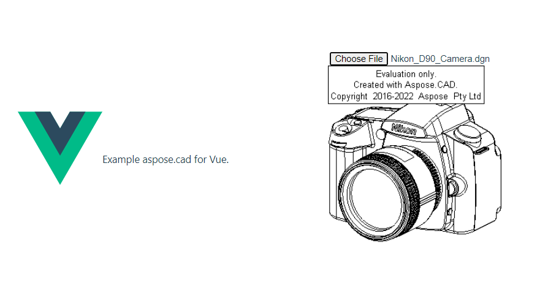

## Prerequisites
- Vue CLI
- Visual Code
- Node.js

## Convert dgn image to png and display in browser

In this example, you create a simple conversion program that converts a drawing and saves it as an image.

## Creating the Vue Project

1. Ensure that you aren't already in an Vue workspace directory.
1. Start a new one and then the name of the program or use other programs to create a project such as Visual Code or WebStorm:

vue create vue-example

1. Install Aspose.CAD from npm package

npm install aspose-cad

1. Create an input type file and img tags to load and display the drawing

<input id="file" type="file">


1. In App.vue, we describe the process of starting the helper processes, processing and show the image


<template>
  <header>
    
    
Example aspose.cad for Vue.

  </header>

  <main>
    <input id="file" type="file">
     
    
  </main>
</template>


1. Start application

npm run dev


## Execution example

1. Choose file. 
 
1. Select any DXF, DWG, DGN, DWF, DWFX, IFC, STL, DWT, IGES, PLT, CF2, OBJ, HPGL, IGS, PCL, FBX, PDF, SVG file.
1. If the answer is successful, the file will be displayed on the screen and will offer to download it. 
 

## See Also

- [Install Visual Code](https://code.visualstudio.com/)
- [Install Node.js](https://nodejs.org/en/)