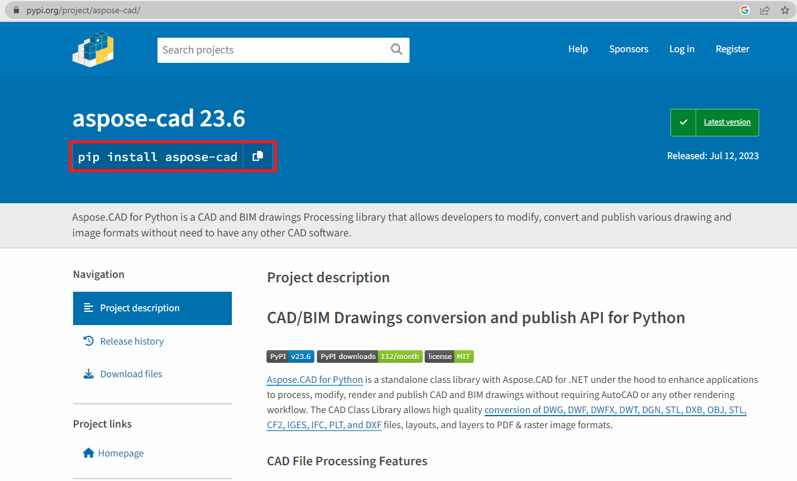
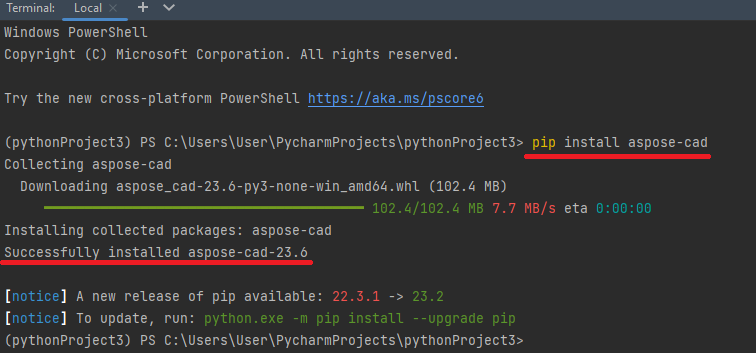
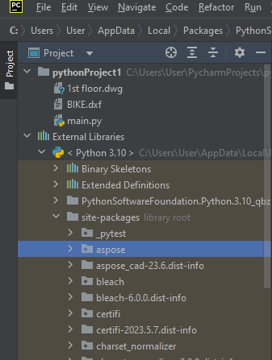

## **Installation of the aspose-cad package**

### Using pip to install a package

1. To install the [aspose.cad](https://pypi.org/project/aspose-cad/) package, the sites with the package have an additional description of the command to be executed in the terminal: 

1. An example of a command to install a package through the terminal:

pip install aspose-cad


### Using WHL file to install a package

1. To download the whl file, go to the pypi page of the [aspose.cad](https://pypi.org/project/aspose-cad/#files) package and download the file 
 
1. To install the [aspose.cad](https://pypi.org/project/aspose-cad/) package, you need to use the pip command with the full path to the whl file:

pip install C:\Users\User\Desktop\aspose_cad-23.6-py3-none-win_amd64.whl


1. After the installation, we will see the package in the site-package folder 

## Example code
Example code for converting a file


import aspose.cad as cad

if __name__ == '__main__':
    
    image = cad.Image.load("drawing.dxf")

    rasterizationOptions = cad.imageoptions.CadRasterizationOptions()
    rasterizationOptions.page_height = 1200.0
    rasterizationOptions.page_width = 1200.0
    
    pdfOptions = cad.imageoptions.PdfOptions()
    pdfOptions.vector_rasterization_options = rasterizationOptions
    image.save("output.pdf", pdfOptions)

